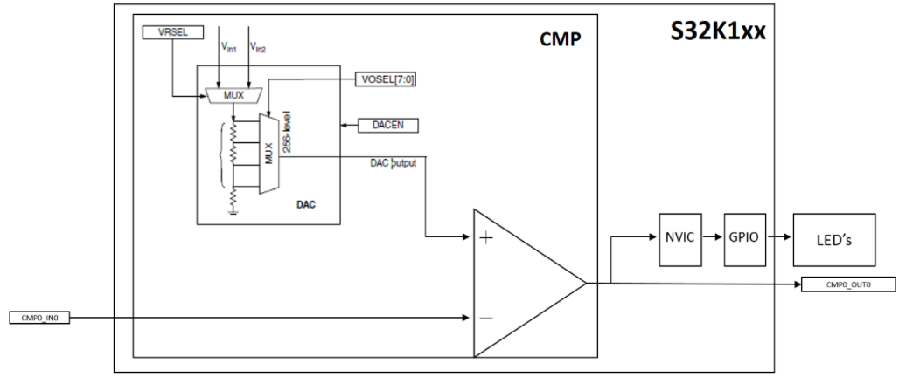

# 04_Comparator

## Description
The CMP is initialized to compare an analogic input with a with a software configurable reference. When the input is higher than the reference, the LED changes of color.

## Design
1. Disable watchdog

2. System clocks: Initialize SOSC for 8 MHz, sysclk for 80 MHz, RUN mode for 80 MHz

3. Initialize port pins:

   * Enable clocks to Port A
   * PTA0: Comparator Input Signal
   * Enable clocks to Port E
   * PTE3: Comparator Output trigger

   * Enable clocks to Port D
   * PTD0: GPIO output - connects to blue LED
   * PTD15: GPIO output - connects to red LED

4. Initiate ACMP with the desired reference (Vref = 3.3*(vosel/255))

5. Enable interrupt

6. Define interrupt routine:

   * LED turns green when the Vin is higher than Vref
   * LED turns red when the Vin is lower than Vref

## Pins definitions

| Pin number | Function         |
| ---------- | ---------------- |
| PTE3       | [CMP0_OUT]       |
| PTA0       | [CMP0_IN0]       |
| PTD15      | GPIO [RED LED]   |
| PTD16      | GPIO [GREEN LED] |

Connect PTC14 (output from the potentiometer) to PTA0.
