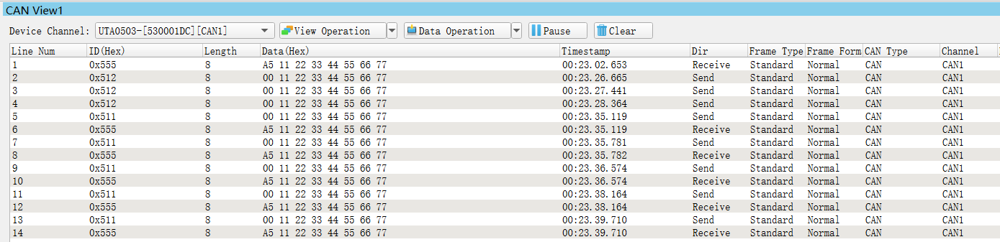

# 06_CAN

## Description
A FlexCAN module is initialized for 500 KHz (2 usec period) bit time based on an 8 MHz crystal. Message buffer 0 transmits 8 byte messages and message buffer 4 can receive 8 byte messages.

This project is intended for connecting one EVB (Node A) to one CAN tool (Node B). After EVB is initialized, it transmits an initial message. EVB then loops: wait to receive a message from the CAN tool, then transmit one back. 

## Design

1. Disable watchdog
2. System clocks: Initialize SOSC for 8 MHz, sysclk for 80 MHz, RUN mode for 80 MHz
3. Initialize port pins:

   * Enable clock to PORT E
   * PTE4, PTE5: Configure as CAN0_RX, CAN0_TX
4. Initialize FlexCAN 0:
   * Enable clock to module
   *  Select OSC for clock source
   * Configure bit timing for 500 KHz transmit/receive
   * Invalidate all message buffers
   * Set incoming mask and global mask bits to check all ID bits of received messages
   * Configure Message Buffer 4 for receive, ID 0x556, Standard ID
   * Negate module halt state for 32 Message Buffers
5. Node A only: Transmit one message with Message Buffer 0, standard ID 0x555
5. Loop:
   *  If Message Buffer 4 receive message flag is set, read message
   * If Message Buffer 0 transmit done flag is set, send another message

## Pins definitions

| Pin number | Function         |
| ---------- | ---------------- |
| PTE4       | [CAN0_RX]        |
| PTE5       | [CAN0_TX]        |
| PTD16      | GPIO [GREEN LED] |

## CAN 2.0 Timing Calculations

These common guidelines are used in CAN 2.0 example for a desired bit rate of 500 KHz:

* CAN bit rate period is typically subdivided into 12–20 time quanta
* The sample point is normally chosen around 75–80% through the bit rate period.
* The remaining 20–25% will be the value for Phase_Seg2.
* The value of Phase_Seg1 will be the same as Phase_Seg2.
* The Sync_Seg is 1 time quantum.
* Resync Jump Width (RJW+1) = Phase_Seg2 (if Phase_Seg2 < 4; otherwise (RJW +1) = 4.

For this example and within the above guidelines, these are the values selected for the CAN module:

* Number of time quanta per bit rate period = 16
* Sample point = 75%, which is 12 time quanta into the 16 time quantum period

Hence,

* Phase_Seg2 = (100% – 75%) × 16 time quanta = 25% × 16 time quanta = 4 time quanta; PSEG2 = 3
* Phase_Seg1 = Phase_Seg2 = 4 time quanta; PSEG1 = 3
* Prop_Seg = 16 – Phase_Seg1 – Phase_Seg2 – SYNCSEG = 16 – 4 – 4 – 1 = 7; PROPSEG = 6
* Resync Jump Width (RJW + 1) = 4

Also for this example, the following applies for an 8 MHz crystal.

* fCANCLK = 8 MHz (EVB oscillator)

Hence,

* fSclock (time quantum freq.) = (16 time quanta/bit rate period) × (500 K bit rate periods/sec)= 8MHz
* Prescaler Value (PRESDIV + 1) = fCANCLK / fSclock = 8 MHz / 8 MHz = 1
* PRESDIV = 1 – 1 = 0

## Result

