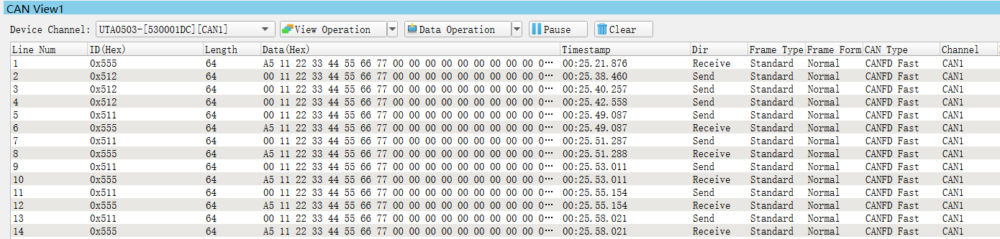

# 07_CANFD

## Description
This project ports the prior Classic CAN to CAN FD with increased data payload and at a CAN FD data phase bit time of 2 MHz. Message size is increased to 64 bytes

This project is intended for connecting one EVB (Node A) to one CAN tool (Node B). After EVB is initialized, it transmits an initial message. EVB then loops: wait to receive a message from the CAN tool, then transmit one back. 

## Design

1. Disable watchdog
2. System clocks: Initialize SOSC for 8 MHz, sysclk for 80 MHz, RUN mode for 80 MHz
3. Initialize port pins:

   * Enable clock to PORT E
   * PTE4, PTE5: Configure as CAN0_RX, CAN0_TX
4. Initialize FlexCAN 0:
   * Enable clock to module
   * Select SYS_CLK (80 MHz) for clock source
   * Configure bit timing for bit rates of 500 KHz nominal phase and 2 MHz data phase
   * Configure transceiver delay compensation
   * Configure payload size
   * Inactivate all message buffers
   * Set up desired transmit and receive buffers
   * Enable CRC fix for ISO CAN FD
   * Enable CAN FD and negate module halt state for 32 Message Buffers
5. Node A only: Transmit one message with Message Buffer 0, standard ID 0x555
5. Loop:
   *  If Message Buffer 4 receive message flag is set, read message
   * If Message Buffer 0 transmit done flag is set, send another message

## Pins definitions

| Pin number | Function         |
| ---------- | ---------------- |
| PTE4       | [CAN0_RX]        |
| PTE5       | [CAN0_TX]        |
| PTD16      | GPIO [GREEN LED] |

## Result

