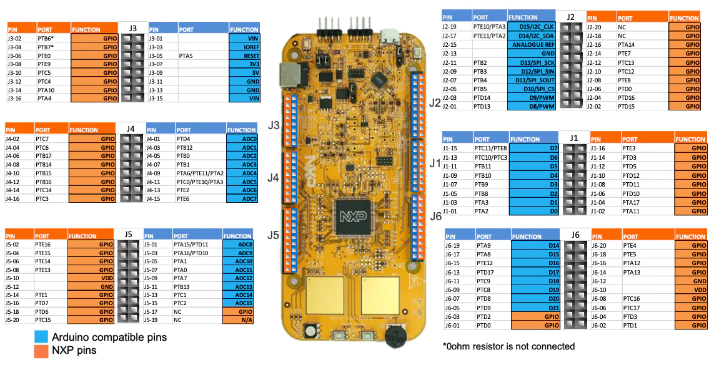
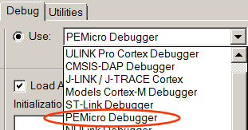
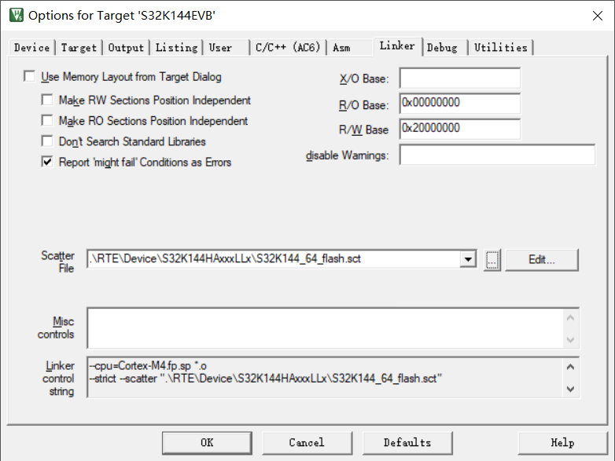

# S32K144EVB-Cookbook
The practices of the S32K14x Series Cookbook Application Note.

They will be implemented using Keil uVision5 (MDK-Community Edition) and tested on the S32K144 evaluation board (S32K144EVB-Q100). 

## S32K144EVB-Q100

The S32K144EVB is a low-cost evaluation and development board for general purpose industrial and automotive applications.

Based on the 32-bit Arm® Cortex®-M4F S32K14 MCU, the S32K144EVB offers a standard-based form factor compatible with the Arduino® UNO pin layout, providing a broad range of expansion board options for quick application prototyping and demonstration.

## MDK Community Edition

MDK-Community is the full-featured, non-commercial software development suite for Cortex®-M-based microcontrollers.

## P&E OpenSDA
OpenSDA is an open-standard serial and debug adapter. It bridges serial and debug communications between a USB host and an
embedded target processor. 

NXP OpenSDA has a P&E and a CMSIS-DAP mode depending on the firmware loaded into the OpenSDA processor U8. We do not need an external debugger such as a ULINK2. 

1. Click on Settings: The P&E Connection Manager window opens.

   

2. In the Interface box, select OpenSDA Embedded Tower Debug - USB Port: 

   

3. Click the Select New Device box, and select your exact processor: 

   

4. Click on the Refresh List and get a valid Port:

   

## Create New Keil Project

1. Project->New uVision Project

2. Select Device: S32K144HAxxxLLx

   

3. Manage Project Items

   

4. Manage RTE: Ensure the CORE and Startup are checked

   

5. Add Include Paths

   

6. Change the Optimization Level to "-O0", it's important for Single-Stepping

   

7. Uncheck "Use Memory Layout from Target Dialog"  and Select "S32K144_64_flash.sct" as Scatter File

   

## Lists

| Number | Project                      | Description                                                  |
| ------ | ---------------------------- | ------------------------------------------------------------ |
| 01     | Hello World                  | Simplest project: Configure GPIO Output to LED follows switch input |
| 02     | Hello World Clock            | Perform common initialization for clocks and LPIT: Initialize System Oscillator (SOSC) Initialize LPIT channel (1 second timeout) Toggle output to LED every LPIT timeout |
| 03     | Hello World Clock Interrupts | The Hello World + Clock example is modified to service the PIT channel timeout with an interrupt service route: Initialize System Oscillator (SOSC) Initialize an LPIT channel for 1 second timeout and enable its interrupt Wait forever At LPIT timeout interrupt, toggle output to LED |

